# Donald Duck's 313 Car

Donald Duck's 313 car re-builded with Lego bricks.

## Build Instruction

Below you can find a printout version of the build instruction for Donald's car.
Alternatively, you can use the [LDraw build instruction](Donald.ldr) for import in LDraw related editors & viewers and commercial lego platforms to buy the bricks of this model.

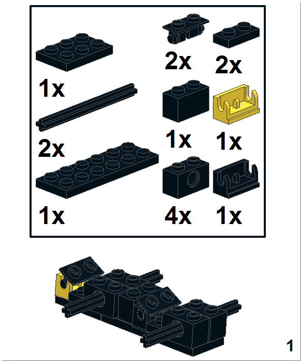
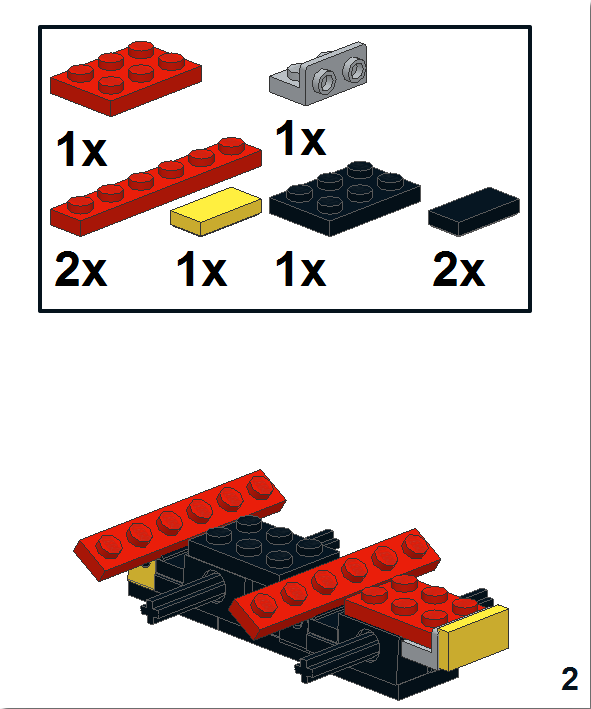
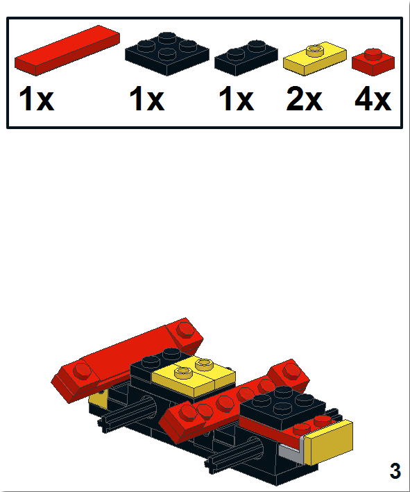
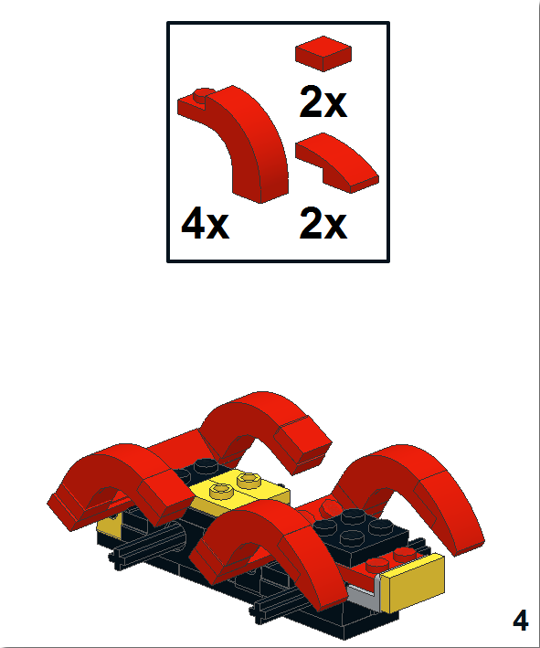
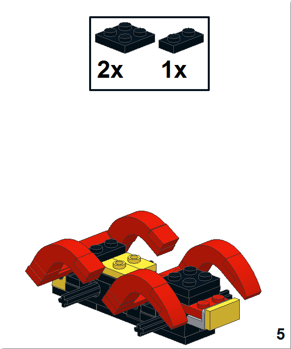
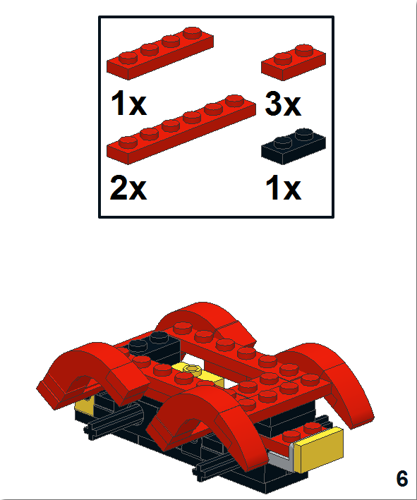
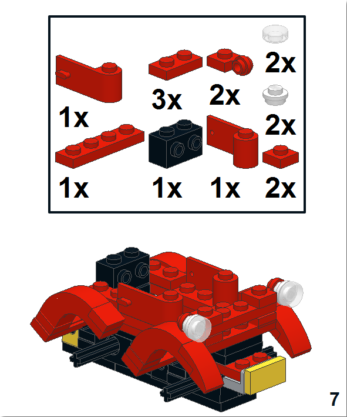
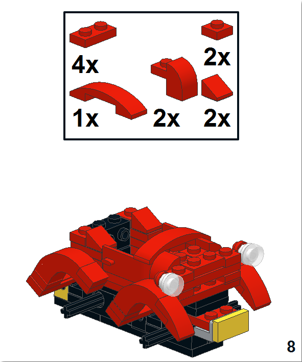
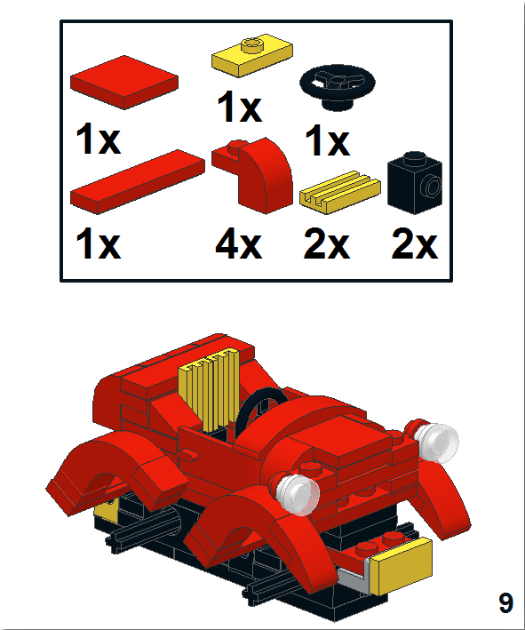
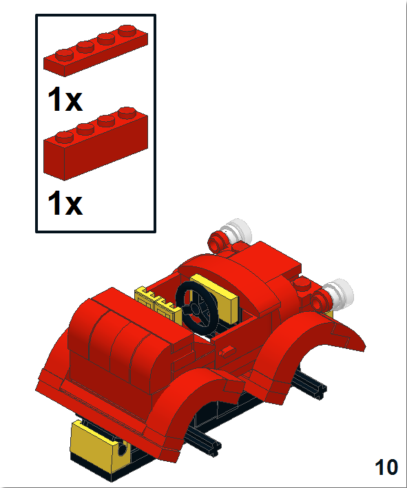
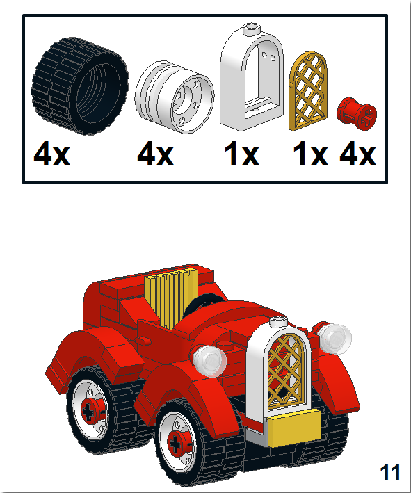
